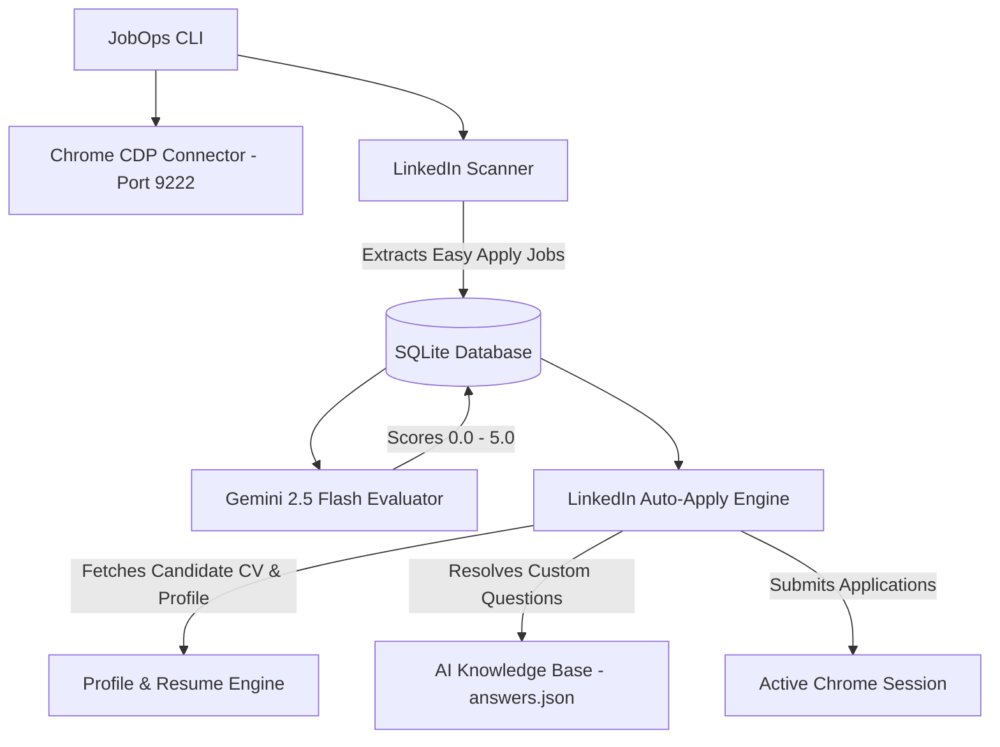

# 🚀 JobOps — Autonomous AI-Powered LinkedIn Automation Engine

**JobOps** is a CLI-driven job application engine built with **Node.js, TypeScript, Playwright, and Google Gemini 2.5 Flash AI**. It automates Pan-India **LinkedIn Easy Apply** job discovery, match evaluation, smart form filling, and hands-free application submission.

---

## 🔥 Key Features

- 🛡️ **Zero-Risk Session Reuse (Chrome CDP Port 9222):** Connects directly to your active, logged-in Chrome browser session to eliminate account ban risks, OTP prompts, and bot-detection blocks.
- 🧠 **Gemini 2.5 Flash AI Evaluator:** Analyzes job descriptions against the candidate's actual resume (`cv.md`) and profile metrics, assigning match relevance scores (0.0 to 5.0).
- 💾 **AI Question Solver & Knowledge Base (`answers.json`):** Automatically answers custom screening questions (CTC, YOE, Notice Period, Visa Sponsorship, Commuting) and persists new answers in a self-learning knowledge base.
- 🌐 **Pan-India Remote & Hybrid Targeting:** Built-in filters (`f_WT=2,3` & `f_AL=true`) specifically targeting Remote & Hybrid Easy Apply postings across India.
- ⚡ **100% Hands-Free Auto-Apply (`--auto`):** Auto-fills input fields, dispatches React/Angular DOM validation events, selects radio choices, handles custom ARIA dropdowns, and submits applications without manual intervention.

---

## 🛠️ Architecture Overview



---

## 📋 System Setup & Configuration

### Candidate Profile (`profile.yml`)
Configure candidate details, notice period, and CTC metrics:
```yaml
name: "Mohammad Zuber"
email: "zuber.shaikh.7415@gmail.com"
phone: "+917489898481"
currentCtcLpa: 3.2
expectedCtcLpa: 6.5
noticePeriodDays: 15
location: "India (Remote / Hybrid / Any Location)"
```

### Environment Variables (`.env`)
Set your Gemini API Key:
```env
GEMINI_API_KEY=your_google_gemini_api_key_here
CDP_PORT=9222
MIN_SCORE_THRESHOLD=2.5
```

---

## 🚀 Quick Start Guide

### Step 1: Launch Chrome Session
Launch Chrome with remote debugging enabled:
```bash
npx ts-node src/index.ts launch-chrome
```
*(Log into LinkedIn once in the opened Chrome window).*

### Step 2: Scan Remote & Hybrid Jobs Across India
```bash
npx ts-node src/index.ts linkedin-scan --query "Angular Developer" --location "India" --pages 3
```

### Step 3: Evaluate Scanned Jobs with Gemini AI
```bash
npx ts-node src/index.ts evaluate
```

### Step 4: Run 100% Hands-Free AI Auto-Apply
```bash
npx ts-node src/index.ts linkedin-apply --min-score 2.5 --auto
```

### Step 5: Check Dashboard & Application Stats
```bash
npx ts-node src/index.ts status
```

---

## 🛠️ Tech Stack

- **Language:** TypeScript / Node.js
- **Browser Automation:** Playwright (CDP Remote Debugging)
- **Artificial Intelligence:** Google Generative AI (`gemini-2.5-flash`)
- **Database:** SQLite (`better-sqlite3`)
- **CLI Framework:** Commander & Inquirer
